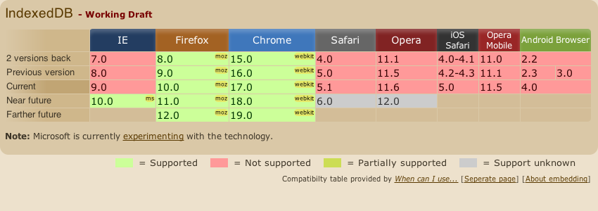

# IndexedDB

---

## Overview

The [Indexed Database API](http://www.w3.org/TR/IndexedDB/) is a great looking spec.  While it's still early days at the moment, the approach shows a lot of promise for working with larger client side datasets.

It is more complicated to work with than the Web Storage APIs (it's asynchronous for a start) but definitely not as painful as WebSQL.

_Examples for this section are modified from an excellent [html5rocks.com](http://www.html5rocks.com/) article:_

_[A Simple ToDo list using HTML5 IndexedDB](http://www.html5rocks.com/en/tutorials/indexeddb/todo/)_

---

## Opening a DB

Opening a database is reasonably simple, and is done through making an open database request:

[[code code/indexeddb/open.js]]

__NOTE:__ While not shown in the example above, the reference to `indexedDB` has been mapped from a vendor prefixed version of IndexedDB.  Depending on your browser it will be one of `webkitIndexedDB`, `mozIndexedDB`, `oIndexedDB` or `msIndexedDB`.

---

## Creating an Object Store

While opening the database was simple enough, things start to go downhill a little from here.  Before we can add objects to our database we need to create an object store using a `db.createObjectStore` call.

Additionally, creating the object store can only be done in the context of a `setVersion` request.  The following is a simplified version of what is usually required:

[[code code/indexeddb/create-object-store.js]]

---
:data-bg:> ../img/468245_79094304.jpg
:data-attribution:> http://www.sxc.hu/photo/468245

# Worth the Climb?

---

# Yes - but I'll spare you the boring bits.

---

## Putting Objects in the Store

Eventually, after a few more calls to `transaction` and `objectStore` functions you can start to put things into your object store:

[[code code/indexeddb/put.js]]

---

## Retrieving Objects from the Store

Retrieving objects from an object store can be very simple.  If you are using it like the Web Storage API, a store supports `get` calls for retrieving an item matching the provided key value:

[[code code/indexeddb/get.js]]

Iterating over the contents of the store requires a [cursor](http://www.w3.org/TR/IndexedDB/#cursor-concept) which is something I won't be touching on tonight. 

---

## Can I Use IndexedDB

So your feeling brave?  Let's see [which browsers support](http://caniuse.com/#feat=indexeddb) IndexedDB.

__Desktop browsers__: maybe, if your apps are experimental or for a narrow audience.

__Mobile browsers__:  Um, no :(

---

## More Information

More information on IndexedDB can be found at the following locations:

- [A Simple ToDo List using HTML5 IndexedDB](http://www.html5rocks.com/en/tutorials/indexeddb/todo/)

- [Using IndexedDB](https://developer.mozilla.org/en/IndexedDB/Using_IndexedDB)

- [Basic Concepts Behind IndexedDB](https://developer.mozilla.org/en/IndexedDB/Basic_Concepts_Behind_IndexedDB)