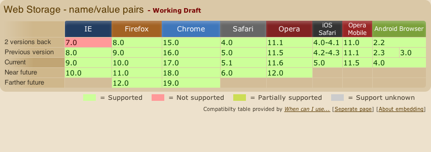

# Web Storage

---

## Overview

The Web Storage spec is by far the easiest of the specs we are going to look at in this session.  

_Don't be fooled by the simple interface though, there is a whole lot you can do with it._

---

## Saving Data

Saving data is a very simple operation and can be performed by calling the `setItem` method of the `localStorage` object:

[[code code/webstorage/simple-put-setItem.js]]

Or you can use a JS setter syntax:

[[code code/webstorage/simple-put-setter.js]]

---

## Getting Data

Getting data is essentially the opposite, and available through the `getItem` method:

[[code code/webstorage/simple-get-getItem.js]]

Or a getter:

[[code code/webstorage/simple-get-getter.js]]

---

## Strings Only Please

The `localStorage` interface is presently designed to store strings only.  For example, consider the following code:

[[code code/webstorage/store-object-incorrect.js]]

---

## JSON to the rescue

To get around this limitation of the web storage spec, we can simply serialise objects to JSON for storage:

[[code code/webstorage/store-object-json.js]]

---

## Iterating through Storage

You can iterate through `localStorage` just like you would other JS objects:

[[code code/webstorage/iterate-foreach.js]]

__OR__

[[code code/webstorage/iterate-object-keys.js]]

---

## Cleaning up Storage

You can remove items using the `removeItem` function:

[[code code/webstorage/remove-removeItem.js]]

Or, by deleting the reference Javascript style:

[[code code/webstorage/remove-delete.js]]

---

## Storage Events

The Web Storage spec also outlines a special `storage` event which can be used to listen for storage changes as they occur:

[[code code/webstorage/events.js]]

__NOTE:__ In the majority of browser implementations, these events are not fired for the browser context (window, tab, etc) that made the storage change, just other contexts that share the storage.

---

## It doesn't stop at localStorage

In addition to the `localStorage` object we also have a `sessionStorage` object that we can play around with also.  Session storage provides a storage container that persists only for the duration of the user session. 

[More Information](http://www.nczonline.net/blog/2009/07/21/introduction-to-sessionstorage/)

---

## Can I Use Web Storage?

Let's have a look at what the [browser support](http://caniuse.com/#feat=namevalue-storage) is like for the web storage spec:

__NOTE:__ If you aren't already using [caniuse.com](http://caniuse.com/) you should be - it's great!

---

## Things to Consider: Security

Use of Web Storage objects are regulated by the [same origin policy](https://developer.mozilla.org/en/Same_origin_policy_for_JavaScript)).

What does this mean?  

Basically, if two pages reside on hosts that __exactly match__ then they will be using the same storage container (e.g. http://one.test.com/ and http://one.test.com/about will share storage).  

If the hosts, ports, or protocols (HTTP vs HTTPS) are different though, the storage containers will be different. (e.g. http://one.test.com/ and http://two.test.com/ do __not__ share storage).

_I need to do more research in this area though_

---

## Things to Consider: Quota

It's important to remember that browser vendors _generally_ like to protect their users, and for this reason some sensible limits are placed on how much data can be injected into Web Storage containers.

Typically this is about 5Mb, but due to the way strings in JS are stored in memory it is actually around 2.5Mb of string data.

It also varies from device to device, browser to browser.

[More information and a Test Suite](http://dev-test.nemikor.com/web-storage/support-test/)

---

## Potential Use Cases

There are many potential use cases for using Web Storage in your web applications and sites:

- Storing user preferences for a web application client-side.
- Caching image data for photo galleries or maps, etc (_remember quotas though..._).
- Implementing intelligent resource loading and caching for scripts / css, etc as an alternative to using [HTML5 offline storage / AppCache](http://dev.w3.org/html5/spec/offline.html).

    This is something I'm planning to [investigate](https://github.com/DamonOehlman/localo).

---

## More Information

For more information on Web Storage, check out the following links:

- [Saving images and files in localStorage](http://hacks.mozilla.org/2012/02/saving-images-and-files-in-localstorage/)

- [Client-side Storage Presentation](http://client-side-storage.appspot.com/) by [Pamela Fox](http://twitter.com/pamelafox) - contains some great real world examples of where localStorage is being used.

